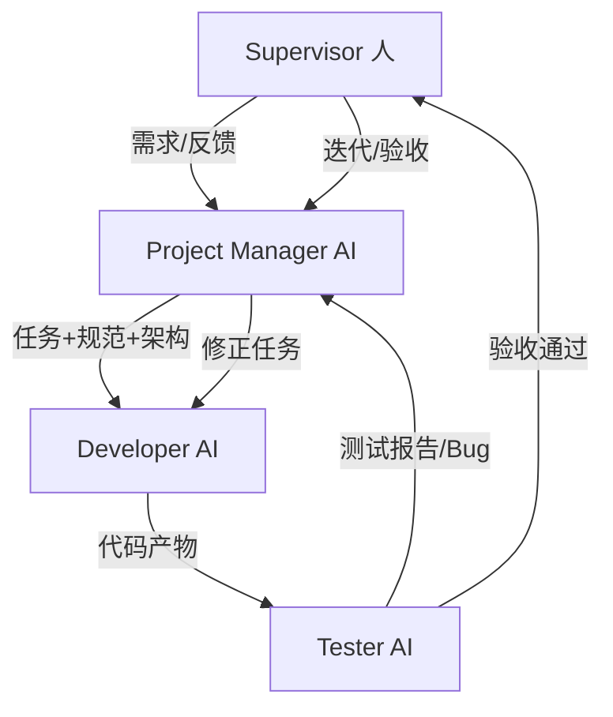

# AI 协作开发架构（精简版）

## 1. 总览

该框架采用“PM 兼任架构”的轻量协作模式，目标是在保证质量与可控性的前提下，提升需求到交付的迭代速度。  
核心原则是：人类掌握方向与最终验收，AI 负责高密度执行与闭环优化。

## 2. 角色职责（最终精简）

### 2.1 Supervisor（人）

- 负责产品方向与业务目标定义。
- 提出需求、补充反馈、确认优先级。
- 进行最终验收与迭代决策。

### 2.2 Project Manager（AI，兼任架构）

- 对需求做去歧义与补全约束。
- 进行架构设计与技术选型。
- 拆解任务、评估工期、调度执行。
- 定义验收标准与测试用例。
- 汇总测试问题并编排修复节奏。

### 2.3 Developer（AI）

- 按任务与规范进行编码实现。
- 执行缺陷修复与必要重构。
- 提交最小自测证据后再移交测试。

### 2.4 Tester（AI）

- 执行功能、边界、回归测试。
- 产出可复现的缺陷报告。
- 验证修复结果并判定是否达标。

## 3. 架构流程图（Mermaid）

## 4. 治理门禁

### 4.1 DoR（Definition of Ready，任务就绪）

PM 下发任务前，每个任务至少包含：

- 明确的业务目标与范围边界。
- 清晰的输入、输出与依赖约束。
- 可量化的验收标准。
- 最小测试点（主流程、边界、异常路径）。

### 4.2 DoD（Definition of Done，完成定义）

Tester 全量验证前，Dev 交付至少包含：

- 符合架构约束的代码实现。
- 最小自测结果（至少主流程 + 一个边界场景）。
- 变更清单与影响说明。
- 已知限制与风险说明（如存在）。

### 4.3 升级机制（Escalation）

出现以下情况时升级到 Supervisor 最终裁决：

- 优先级冲突导致排期无法收敛。
- 架构取舍显著影响质量属性（性能、稳定性、安全性）。
- 测试争议经 PM 协调后仍无法达成一致。

## 5. 标准产物模板

### 5.1 任务卡模板

- Task ID：
- 目标：
- 范围（In/Out）：
- 输入/输出：
- 约束条件：
- 验收标准：
- 测试用例：
- Owner：
- ETA：

### 5.2 缺陷单模板

- Bug ID：
- 严重级别：
- 环境信息：
- 复现步骤：
- 预期结果：
- 实际结果：
- 证据链接：
- 关联任务/提交：

### 5.3 测试报告模板

- 迭代版本：
- 覆盖范围：
- 通过用例：
- 失败用例：
- 阻塞问题：
- 回归结果：
- 最终建议（通过/返工）：

## 6. 建议迭代节奏

- 迭代起点：需求接入与目标确认。
- 当日完成：PM 拆解任务并完成调度。
- 开发节奏：Dev 按日批次交付与自测。
- 测试节奏：Tester 对每个交付批次执行验证与回归。
- 里程碑节点：Supervisor 完成阶段验收与下一轮反馈。

## 7. 落地建议

- 保持任务颗粒度小且可独立验证。
- 验收标准与测试用例保持单一事实来源。
- 未满足 DoR 的任务不进入开发。
- 未满足 DoD 的交付不进入“完成”状态。
- 测试反馈作为 PM 下一轮调度的强制输入。
